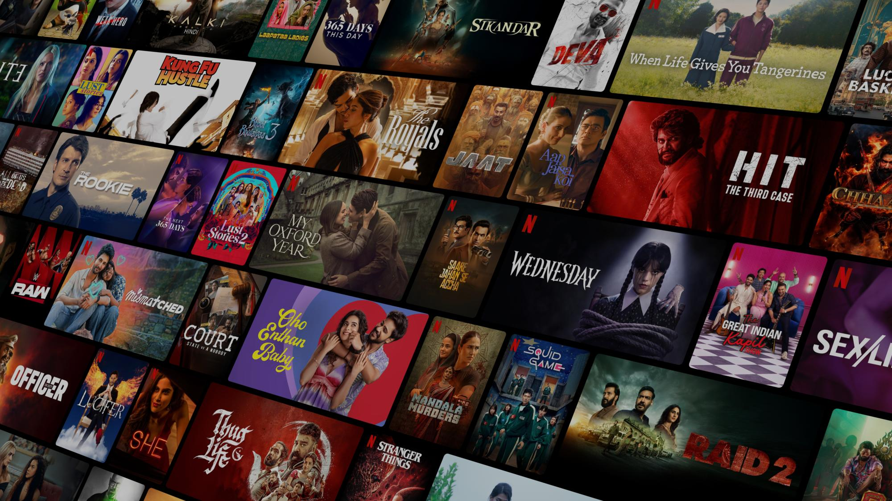

# 🎬 Netflix India Clone

A **Netflix India Landing Page Clone** built using **HTML** and **CSS**.  
This project replicates the look and feel of Netflix’s official landing page with a modern and responsive design.

---

## 📸 Preview


---

## 🚀 Features
- 📺 **Hero Section** with background image and call-to-action  
- 🔘 **Buttons** styled like Netflix (Sign In, Get Started)  
- 📱 **Responsive Design** using media queries  
- 🎥 **Embedded Videos** inside device mockups  
- ❓ **FAQ Section** styled with hover effects  
- 🦶 **Footer** with multiple navigation links  

---

## 🛠️ Tech Stack
- **HTML5**  
- **CSS3**  
- **Google Fonts** (Martel Sans, Poppins, Baloo Bhai 2)  

---

## 📂 Project Structure
```
Netflix-Clone/
│── index.html          # Main HTML file
│── style.css           # Stylesheet
│── Assets/
│    ├── images/        # Images (logo, background, etc.)
│    └── videos/        # Videos (TV, mobile, devices)
```

---

## ⚡ Setup & Usage
1. Clone this repository:
   ```bash
   git clone https://github.com/BharatBhushan2608/netflix-clone.git
   ```
2. Navigate to project folder:
   ```bash
   cd netflix-clone
   ```
3. Open `index.html` in your browser.

---

## 📱 Responsive Design
- ✅ Works on desktops, tablets, and mobile devices.  
- ✅ Layout adjusts using **media queries**.  

---

## 📌 Future Enhancements
- Add **JavaScript** for FAQ toggle (expand/collapse).  
- Add **sign-up form validation**.  
- Enhance animations and transitions.  

---

## 👨‍💻 Author
- **Your Name**  
- 🌐 [GitHub Profile](https://github.com/BharatBhushan2608)  

---

## 📜 License
This project is for **educational purposes only**.  
All images & assets belong to **Netflix**.  
